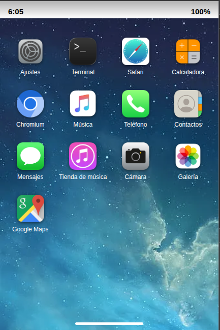

# Guadaware

**Guadaware** is the desktop environment for **Guadafón**, an open mobile device project made in Andalusia. It provides a touch-first, graphical shell with a lock screen, home screen and a growing collection of built-in applications — all running on top of standard Linux tools.

Guadaware is architected to be portable. The idea is to build a chroot environment for Guadaware that interrupts the boot of Android to load Guadaware.


## Dependencies

- **Python 3** with the **Bottle** micro-framework (`python3 -m pip install bottle`)
- **cage** — Wayland kiosk compositor
- **Chromium** — Web view engine
- **NetworkManager** (`nmcli`) — Wi-Fi, cellular and airplane-mode control
- **ModemManager** (`mmcli`) — SIM status, PIN/PUK management, SMS and modem control
- **curl** — used by the Safari proxy
- **gnome-calls** - used to make calls
- **gnome-contacts** - used to manage contacts
- Common CLI utilities: `poweroff`, `free`, `df`, `lscpu`, `lspci`

## Running

### One-shot launcher

The whole desktop — system API, GUI server and Cage session — is started with a single command.

Run it straight from this repository:

```sh
./usr/bin/startguadaware
```

Or install it system-wide first:

```sh
sudo cp -r usr/lib /usr/
sudo install -m 755 usr/bin/startguadaware /usr/bin/
/usr/bin/startguadaware
```

### Running the services individually

For debugging, each layer can be started on its own:

Start the system API (must run from `usr/lib/libguadaware/`, it uses relative paths):

```sh
cd usr/lib/libguadaware
python3 guadawareSystemAPI.py
```

Start the GUI server:

```sh
./usr/lib/libguadaware/guadawareGUI/guadawareGUIServer
```

Launch the desktop:

```sh
./usr/lib/libguadaware/clientstart
```

## License

Guadaware is licensed under the **GNU General Public License version 3 (GPL-3.0)**. See the [LICENSE](LICENSE) file for details.

The bundled Calculator app is a third-party component licensed under the **MIT License** (see `guadawareGUI/apps/calculator/LICENSE`).